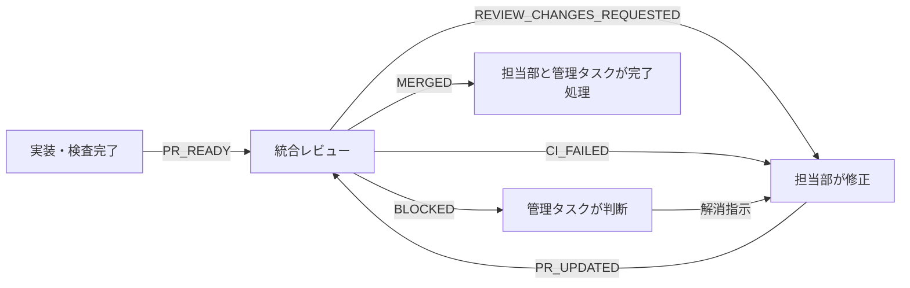

# 部門間イベント駆動ハンドオフ

最終検証日: 2026-08-09

## 目的

実装、レビュー、修正、マージをタスク間メッセージで直結する。定期実行と会話履歴へ依存せず、発生元が次の責任者を起動する。

## 部門と責任

| 部門 | 送信責任 | 応答責任 |
| --- | --- | --- |
| 実装部門 | PR作成・更新後に `PR_READY` | `REVIEW_CHANGES_REQUESTED`を受けた修正、再検査、再通知 |
| 統合・リリース管理部 | レビュー後に判定、マージ後に `MERGED` | `PR_READY`の差分、CI、競合、決裁境界を確認 |
| 管理タスク | 部門間競合とCEO決裁要求を処理 | `BLOCKED`と決裁要求に判断を返す |

## イベント契約

全イベントは次の非機密payloadを持つ。

```text
event: PR_READY | REVIEW_CHANGES_REQUESTED | PR_UPDATED | CI_FAILED | MERGED | BLOCKED
repository: owner/name
issue: #number
pr: #number + URL
head_sha: full SHA
purpose: one sentence
checks: command/status summary
ceo_boundary: none | category and reason
sender: department/task name
next_action: receiver's observable action
```

値が存在しない項目は `none` と書く。APIキー、token、email、ユーザー入力、アップロード内容をpayloadへ入れない。

## 状態遷移



## 発火規則

### PR_READY

- 発火: PR作成直後、またはレビュー済みSHAから新しいSHAをpushした直後
- 送信者: 実装部門
- 受信者: 統合・リリース管理部
- 受信者の行動: head SHA一致を確認し、差分とCIのレビューを開始する

### REVIEW_CHANGES_REQUESTED

- 発火: P1/P2、受入条件不足、検査不足、競合、文字化けを検出した直後
- 送信者: 統合・リリース管理部
- 受信者: PRを所有する実装部門
- 受信者の行動: 再現テストを追加し、修正、全検査、`PR_UPDATED`を送る

### PR_UPDATED

- 発火: 差し戻し修正をpushした直後
- 送信者: 実装部門
- 受信者: 統合・リリース管理部
- 受信者の行動: 以前の承認を破棄し、新しいhead SHAを再レビューする

### CI_FAILED

- 発火: CI失敗を確認した直後
- 送信者: CIを最初に確認した部門
- 受信者: PRを所有する実装部門
- 受信者の行動: 原因を再現し、修正後に `PR_UPDATED`を送る

### MERGED

- 発火: PRマージとmainのsmoke確認後
- 送信者: 統合・リリース管理部
- 受信者: 実装部門と管理タスク
- 受信者の行動: 依存PRの開始、Issue状態とプレビューURLの確認を行う

### BLOCKED

- 発火: CEO決裁、部門間仕様衝突、送信不能、外部状態待ちを検出した直後
- 送信者: 検出した部門
- 受信者: 管理タスク。CEO決裁案件は管理タスクから利用者へ提示する
- 受信者の行動: 決定者、必要な判断、停止範囲を明示する

## 配信方法

1. Codexの既存タスクへメッセージを送り、そのタスクの新しいturnを起動する。
2. 受信タスクIDは各部門の引き継ぎ文書または管理タスクが保持する。タスクIDをソースコードへハードコードしない。
3. 送信に失敗した場合、PRコメントへpayloadを記録し、管理タスクへ `BLOCKED`を送る。
4. 同じ `event + pr + head_sha` は冪等キーとし、受信側は二重処理しない。

## レビューとマージの停止条件

- 通知されたhead SHAとPRのhead SHAが一致しない
- required CIが未完了または失敗
- merge conflictがある
- P1/P2指摘が未解決
- PR本文のUTF-8 read-backが異常
- CEO決裁境界に該当し、決裁記録がない

いずれかに該当した場合はマージせず、`REVIEW_CHANGES_REQUESTED`または`BLOCKED`を送る。

## 新規タスクの起動チェック

1. ルート`AGENTS.md`を読む。
2. 本文書で自部門の送信責任と応答責任を確認する。
3. 管理タスクから現在の部門タスク宛先を受け取る。
4. 自分が所有するIssue、branch、PR、最新head SHAを確認する。
5. 未送信イベントがあれば、実装を始める前に送信する。
