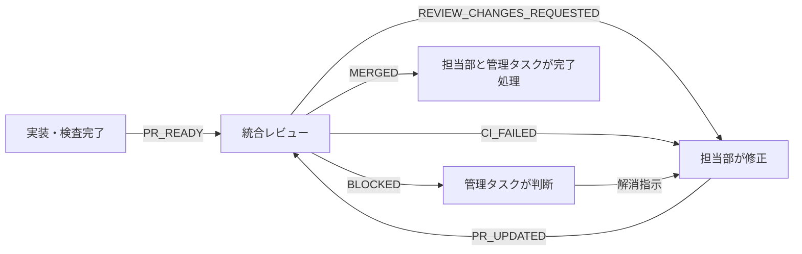

# 部門間イベント駆動ハンドオフ

最終検証日: 2026-08-09

## 目的

実装、レビュー、修正、マージをタスク間メッセージで直結する。定期実行と会話履歴へ依存せず、発生元が次の責任者を起動する。

## 部門と責任

| 部門 | 送信責任 | 応答責任 |
| --- | --- | --- |
| 実装部門 | PR作成・更新後に `PR_READY` | `REVIEW_CHANGES_REQUESTED`を受けた修正、再検査、再通知 |
| 統合・リリース管理部 | レビュー後に判定、マージ後に `MERGED` | `PR_READY`の差分、CI、競合、決裁境界を確認 |
| 管理タスク | 部門間競合とCEO決裁要求を処理 | `BLOCKED`と決裁要求に判断を返す |

## リソース管理と部門所有権

統合・リリース管理部は、Issue assignment、WIP制限、依存順、変更ファイル所有権を決める。未割当Issueを実装部が独自に開始してはならない。実装開始は統合部の `ASSIGNMENT` または `DEPENDENCY_READY` を受信した後に限る。

| 部門 | 所有範囲 |
| --- | --- |
| 会話体験・プロジェクト部 | chat、project workflow、data-context |
| プロダクトUI・デザインシステム部 | surface、layout、navigation、tokens、a11y primitives |
| 品質・プロダクト運用部 | 独立検証 |
| 基盤・認証部 | auth、runtime |
| 事業設計・調査部 | domain、API contracts |

`App.jsx` とshared styleの同時変更は禁止する。両方が必要な場合、統合部は担当部、ファイル所有権、依存順、時分割を `ASSIGNMENT` に明記する。

### 部門task owner registryと移管

| 部門 | 現owner task | WIP | 移管状態 |
| --- | --- | --- | --- |
| 品質・プロダクト運用部 | `019fe475-2b12-72c2-91c6-007e5a5ef0ba` | T-IA-01 implementation 1 | `019fe36f-6bba-7653-8499-325c528e30fa`は移行記録のみ。新規ASSIGNMENTを送らない。 |
| 基盤・認証部 | `019fe475-2b1d-7621-86e5-84b4a434f569` | #89 implementation 1 | `019fe36f-5228-7f71-9519-3a09b73922ee`は移行記録のみ。新規ASSIGNMENTを送らない。 |

新owner taskはLuna/low部長本人の実装環境である。移管後の同一Issueは新owner taskを含むidempotency keyで送信し、旧taskのBLOCKEDを新taskへ引き継がない。

各実装部のWIP上限は、レビュー待ち1PRと実装中1件までとする。統合部はレビューキューを優先して空にする。

### ASSIGNMENT payload

```text
event: ASSIGNMENT
repository: owner/name
issue: #number
purpose: one sentence
owner_task: receiving department task
model: assigned model
thinking: assigned reasoning effort
file_ownership: exclusive files or directories
dependencies: required merge SHAs or none
wip_slot: implementation | review
acceptance_criteria: observable acceptance criteria
change_prohibitions: excluded scope
next_action: receiver's observable action
```

同じ `issue + owner_task` は冪等キーとし、受信側は重複着手しない。

### 統合部運用PRの独立レビュー

統合・リリース管理部が所有する運用文書PRは通常の実装PRではない。作成者は自部門taskへ`PR_READY`、`MERGED`、またはreview判定を送らない。作成後に統合部が別部門の部長を独立reviewerとして指定し、次のpayloadで`REVIEW_REQUEST`を送る。reviewerは全文diff、通知SHA、CI、UTF-8 PR本文read-back、正本との整合を確認し、`REVIEW_APPROVED`または`REVIEW_CHANGES_REQUESTED`を統合部へ返す。統合部はapprovedされた通知SHAだけをmergeする。

```text
event: REVIEW_REQUEST
repository: owner/name
pr: #number + URL
head_sha: full SHA
purpose: one sentence
reviewer_task: independent department lead task
checks: scope and completed checks
acceptance_criteria: observable review gates
change_prohibitions: excluded scope
next_action: REVIEW_APPROVED or REVIEW_CHANGES_REQUESTED
```

統合部運用PRの自己通知・自己レビュー・自己マージ循環は拒否する。直前の「自部門PR_READY」「自部門turnで通知SHA確認」規則はこの独立review方式に置換する。

## 役割別モデルプロファイル

| 役割 | model / thinking |
| --- | --- |
| CEO室 | `gpt-5.6-terra / medium` |
| 統合・リリース管理部 | `gpt-5.6-terra / medium` |
| 会話体験・プロジェクト部 | `gpt-5.6-luna / low` |
| プロダクトUI・デザインシステム部 | `gpt-5.6-luna / low` |
| 品質・プロダクト運用部 | `gpt-5.6-luna / low` |
| 基盤・認証部 | `gpt-5.6-luna / low` |
| 事業設計・調査部 | `gpt-5.6-luna / low` |

指定モデルが利用不能な場合だけ、担当部は統合部へ `BLOCKED`（`reason: model_unavailable`）を送る。統合・リリース管理部自身が利用不能な場合はCEO室へ同じ理由で送る。無断でTerraその他のプロファイルへ切り替えてはならない。統合部とCEO室も表の指定プロファイルを守る。

会話体験、UIデザイン、品質、基盤認証、事業設計の各部長は`gpt-5.6-luna / low`で自ら実装する。部門間の通常作業ではsubagentをspawnしない。subagentを明示的に使う場合だけTerra制約を適用する。Luna/lowが利用できる部長実装を`model_unavailable`として止めてはならない。

`ASSIGNMENT` と `DEPENDENCY_READY` は `model` と `thinking` を必須項目とする。送信側はpayloadの同じoverrideで受信部の新turnを起動する。

## 全社ポートフォリオ管理と要件決定

CEO室は全社ポートフォリオ管理・要件決定を所有する。CEO室は実装部へ直接実装指示せず、優先順位、Issue配分、WIP再配分、停止・再開、部門境界だけを `PORTFOLIO_DIRECTIVE` で統合・リリース管理部へ送る。統合部はこれを `ASSIGNMENT` または `DEPENDENCY_READY` に翻訳し、実装部はその割当済みスコープだけを実装する。

### ORG_HEALTH

統合部は次の非merge起因の状態変化の直後に限り、CEO室へ独立`ORG_HEALTH`を送る。PR mergeとmain smoke成功時の状態はCEO室向け`MERGED.org_health`に内包し、独立イベントを送らない。定期ポーリングは追加しない。payloadの正規化した内容をstate fingerprintとし、同じfingerprintは二重送信しない。

- 部門のWIPが0または上限超になった。
- P0 BLOCKED、同一ファイル所有権競合、依存先未割当、またはCEO決裁境界が発生した。

```text
event: ORG_HEALTH
repository: owner/name
state_fingerprint: deterministic digest of the fields below
trigger: wip_zero_or_over_limit | p0_blocked | file_ownership_conflict | dependency_unassigned | ceo_boundary
main_sha: full SHA
merge_source: PR and merge SHA or none
departments: active/idle and WIP by department
review_queue: open review PRs and owner
unassigned_ready_issues: ready Issue numbers or none
dependency_blocks: source -> target or none
ownership_conflicts: files/scopes or none
next_allocation_candidates: ready work and owner
model_availability: profile availability by affected department
released_capacity: work unlocked by merge or none
next_24h_risks: likely stop points or none
next_action: CEO portfolio decision or acknowledge
```

idle部門とready/unassigned work、P0 block、所有権競合、またはCEO境界が同じ`ORG_HEALTH`または`MERGED.org_health`にある場合、CEO室は同じ因果連鎖で1通の`PORTFOLIO_DIRECTIVE`を返す。統合部は同一turnで`ASSIGNMENT`または`DEPENDENCY_READY`へ翻訳し、delivery成功と受信部のactiveまたは`BLOCKED(model_unavailable)`を確認する。該当がなければCEO室は応答しない。

通常のCI詳細やP1/P2詳細は `ORG_HEALTH` に含めない。

### PORTFOLIO_DIRECTIVE

```text
event: PORTFOLIO_DIRECTIVE
repository: owner/name
priority_order: ordered Issues/goals
issue_allocation: Issue -> department or none
wip_reallocation: department -> target WIP or none
stop_resume: scopes to stop/resume or none
boundary_direction: ownership decision or none
reason: portfolio or requirement rationale
next_action: integration translates to ASSIGNMENT/DEPENDENCY_READY
```

### REQUIREMENT_REQUEST

CEO室がユーザーへ送る `REQUIREMENT_REQUEST` は、P0の実装または受入条件が決められない、複数部の設計が衝突する、価格・外部接続・個人情報・法務などCEO決裁が必要な場合に限定する。質問には判断可能な選択肢、推奨、未決時に停止する範囲を必須とする。通常の進捗確認、CI失敗、P1/P2の報告には使わない。

## CEO室レポートライン

通常経路では、実装部は `PR_READY` を統合・リリース管理部だけへ送る。PR作成時点のCEO室通知は禁止する。統合部がmergeとmain smokeを完了した後、`MERGED` をCEO室と担当部へ送る。

PR時点でCEO室へ `BLOCKED` または `DECISION_REQUIRED` を送れる例外は、次のいずれかに限る。

- 外部公開、支出、契約、法務、個人情報送信
- 実外部サービス初期接続、破壊的API、データ移行
- 部門間仕様衝突、P0セキュリティ、データ損失
- main回帰またはrevert判断
- 500行超、または複数目的で分割判断が必要

CI失敗と通常のP1/P2は担当部と統合部だけで解決し、CEO室へ送らない。

CEO室向け `MERGED` payloadには、PR、目的、ユーザー影響、検査結果、ロールバック方法、次の依存作業、次の`org_health`を含める。詳細diffはPRリンクのみで参照させ、payloadへ転載しない。

```text
org_health:
  main_sha: full SHA
  merge_source: PR and merge SHA
  released_capacity: work unlocked by merge or none
  departments: active/idle and WIP by department
  review_queue: open review PRs and owner
  ready_unassigned_work: ready Issue numbers or none
  dependency_blocks: source -> target or none
  ownership_conflicts: files/scopes or none
  model_availability: profile availability by affected department
  next_allocation_candidates: ready work and owner
  dependency_delivery: target, idempotency key, and delivery result or none
```

同じmerge SHAの`MERGED`は冪等とする。merge起因の状態について、同じstate fingerprintを独立`ORG_HEALTH`でも送信してはならない。

CEO室は`MERGED.org_health`を受信したturnで、同じmerge SHAに対して`PORTFOLIO_DIRECTIVE`を必ず1通返す。actionは次の3種だけとする。返信なしを承認扱いにしてはならない。

- `GO_ON`: 提案済みのdependency handoffと既定配分を要件変更なしに実行する。
- `CHANGE`: 優先順位、Issue、WIP、担当、停止を明示して上書きする。
- `BLOCK`: CEO決裁または要件回答待ちとして停止対象を限定する。

`GO_ON`は承認待ちを増やさない軽量な継続指示である。統合部はGO_ONまたはCHANGEを受け次第、`ASSIGNMENT`または`DEPENDENCY_READY`を実行してreceiver activeまたは`BLOCKED(model_unavailable)`を確認する。通常の進捗とCI詳細はCEO室へ送らない。

CEO返信前に統合部が実行できるのは、既承認計画に明記された`DEPENDENCY_READY`、merge smoke、review queue継続だけである。新規Issue選択、idle部門への新規ASSIGNMENT、優先順位変更、WIP再配分は`PORTFOLIO_DIRECTIVE`を受けてから実行する。CEO決裁境界、要件未決、所有権衝突、P0 BLOCKEDは`REQUIREMENT_REQUEST`または`BLOCKED`を送る。

## イベント契約

全イベントは次の非機密payloadを持つ。

```text
event: PR_READY | REVIEW_REQUEST | REVIEW_APPROVED | REVIEW_CHANGES_REQUESTED | PR_UPDATED | CI_FAILED | MERGED | BLOCKED
repository: owner/name
issue: #number
pr: #number + URL
head_sha: full SHA
purpose: one sentence
checks: command/status summary
ceo_boundary: none | category and reason
sender: department/task name
next_action: receiver's observable action
```

値が存在しない項目は `none` と書く。APIキー、token、email、ユーザー入力、アップロード内容をpayloadへ入れない。

### DEPENDENCY_READY payload

`DEPENDENCY_READY` は、次の部門がmerge済み契約を実装・設計へ使える状態になったことを伝える。必須項目は次のとおり。

```text
event: DEPENDENCY_READY
repository: owner/name
source_pr: #number + URL
source_merge_sha: full SHA
provided_contract: reusable contract summary
next_issue_or_goal: next issue or observable goal
acceptance_criteria: observable acceptance criteria
change_prohibitions: prohibited scope and boundaries
checks: merge and verification summary
owner_task: receiving department task
model: assigned model
thinking: assigned reasoning effort
idempotency_key: source merge SHA + target department
next_action: receiver's observable action
```

同じ `source_merge_sha + target department` は冪等キーとし、受信側は同じhandoffを二重に開始しない。

## 状態遷移



## 発火規則

### PR_READY

- 発火: PR作成直後、またはレビュー済みSHAから新しいSHAをpushした直後
- 送信者: 実装部門
- 受信者: 統合・リリース管理部
- 受信者の行動: head SHA一致を確認し、差分とCIのレビューを開始する

### REVIEW_CHANGES_REQUESTED

- 発火: P1/P2、受入条件不足、検査不足、競合、文字化けを検出した直後
- 送信者: 統合・リリース管理部
- 受信者: PRを所有する実装部門
- 受信者の行動: 再現テストを追加し、修正、全検査、`PR_UPDATED`を送る

### PR_UPDATED

- 発火: 差し戻し修正をpushした直後
- 送信者: 実装部門
- 受信者: 統合・リリース管理部
- 受信者の行動: 以前の承認を破棄し、新しいhead SHAを再レビューする

### CI_FAILED

- 発火: CI失敗を確認した直後
- 送信者: CIを最初に確認した部門
- 受信者: PRを所有する実装部門
- 受信者の行動: 原因を再現し、修正後に `PR_UPDATED`を送る

### MERGED

- 発火: PRマージとmainのsmoke確認後
- 送信者: 統合・リリース管理部
- 受信者: 実装部門と管理タスク
- 受信者の行動: 依存PRの開始、Issue状態とプレビューURLの確認を行う

`next_dependencies` が空でない場合、統合部はCEO室への`MERGED`送信前に、次担当部を直接起動する`DEPENDENCY_READY`を送り、delivery成功を`MERGED.org_health.dependency_delivery`へ記録する。送信成功の確認までmerge後handoffは未完了とする。

merge後handoffは次の順序をすべて満たすまで未完了とする。

1. main smoke成功後に、`next_dependencies`があれば`DEPENDENCY_READY`を送りdelivery成功を確認する。
2. 担当部へ`MERGED`を送り、CEO室へは全社状態、dependency delivery、next allocation candidatesを内包する`MERGED`を1通だけ送る。
3. CEO室が同じmerge SHAに対して必ず返す`PORTFOLIO_DIRECTIVE action=GO_ON|CHANGE|BLOCK`を受信する。
4. GO_ONまたはCHANGEを`ASSIGNMENT`または`DEPENDENCY_READY`へ翻訳し、deliveryと受信部のactiveまたは`BLOCKED(model_unavailable)`を確認する。BLOCKは停止対象だけを記録する。

回帰ケース: PR #112の計画merge後に初期assignmentが同一turnで配信されなかった。以後、merge後handoffのreview checklistはdependency delivery、`MERGED.org_health`、CEO室の`PORTFOLIO_DIRECTIVE action=GO_ON|CHANGE|BLOCK`、assignment delivery、receiver stateをすべて検査する。PR #115直後に送られた`MERGED`と独立`ORG_HEALTH`は3通だった旧形式として、この二重送信を再発させない。CEO返信なしを承認扱いにして新規配分したdefault allocation案は、CEO室のポートフォリオ決定権を損なうため却下する。

次担当が明確なら統合部が直接起動する。未割当、優先順位競合、新scope、CEO境界だけはCEO室へ `DECISION_REQUIRED` を送る。CI失敗と通常P1/P2はこの例外に含めない。

### BLOCKED

- 発火: CEO決裁、部門間仕様衝突、送信不能、外部状態待ちを検出した直後
- 送信者: 検出した部門
- 受信者: 管理タスク。CEO決裁案件は管理タスクから利用者へ提示する
- 受信者の行動: 決定者、必要な判断、停止範囲を明示する

## 配信方法

1. Codexの既存タスクへメッセージを送り、そのタスクの新しいturnを起動する。
2. 受信タスクIDは各部門の引き継ぎ文書または管理タスクが保持する。タスクIDをソースコードへハードコードしない。
3. 送信に失敗した場合、PRコメントへpayloadを記録し、管理タスクへ `BLOCKED`を送る。
4. 同じ `event + pr + head_sha` は冪等キーとし、受信側は二重処理しない。

## レビューとマージの停止条件

- 通知されたhead SHAとPRのhead SHAが一致しない
- required CIが未完了または失敗
- merge conflictがある
- P1/P2指摘が未解決
- PR本文のUTF-8 read-backが異常
- CEO決裁境界に該当し、決裁記録がない

いずれかに該当した場合はマージせず、`REVIEW_CHANGES_REQUESTED`または`BLOCKED`を送る。

## 新規タスクの起動チェック

1. ルート`AGENTS.md`を読む。
2. 本文書で自部門の送信責任と応答責任を確認する。
3. 管理タスクから現在の部門タスク宛先を受け取る。
4. 自分が所有するIssue、branch、PR、最新head SHAを確認する。
5. 未送信イベントがあれば、実装を始める前に送信する。

## 統合・リリース管理部の実行プロファイル

- 標準プロファイルは `gpt-5.6-terra / medium` とする。
- プロファイルが利用不能な場合だけ、管理タスクへ `BLOCKED` を送る。
- 代替モデル・推論強度への無断変更はしない。管理タスクの明示判断を受けてから変更する。
