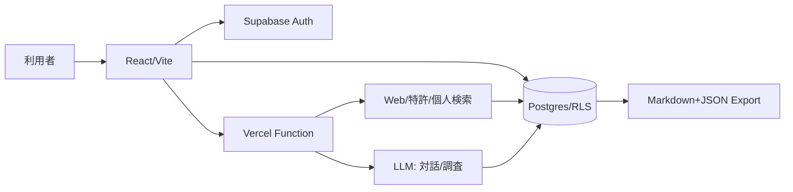

# Dots. アーキテクチャ決定 v0.2（ピボット前の履歴）

> 2026-09-20以降のNeo4j候補、ローカルMCP、ChatGPT Deep Researchとの責務分離、read / write境界は[Dots Founder Graph ピボット・実装全体計画](../plans/founder-graph-pivot.md)を正本とする。本書のSupabase / Postgres / Vercel構成は移行inventoryの入力として保持する。

## 境界

React + Viteをクライアント、Supabase Auth/Postgresを所有データ、Vercel Functionsを認証済みのAI実行境界にします。LLMは対話、アイデア仮説カード、根拠付き調査レポートの生成に使い、権限、課金上限、データ削除は決定的なコードで行います。

## 最小テーブル

- `ideas`: owner_id, pain_statement, status
- `decision_records`: idea_id, category, reason, decided_at
- `consents`: user_id, anonymized_statistics_opt_in, withdrawn_at
- `deletion_requests`: user_id, requested_at, completed_at

全テーブルはowner_idのRLSを必須とし、サービスロールはVercel Functionだけが使います。

横断調査、アップロード資料のハイブリッド検索、意思決定記憶の既存契約は[横断調査・個人ナレッジ・意思決定記憶 計画](research-memory-plan.md)を移植元として参照する。新規実装のDBとMCP境界はFounder Graph計画を優先する。

## 品質・運用

Storybook、lint、unit test、buildはPR必須です。scheduleは作らず`workflow_dispatch`だけを許可します。1PRは1タスク、最大10反復・2時間。安定認定2回とceo-decisionまでは自動化を昇格しません。
