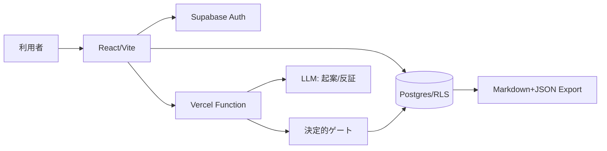

# Kadode アーキテクチャ決定 v0.1

## 境界

React + Viteをクライアント、Supabase Auth/Postgresを所有データ、Vercel Functionsを認証済みのAI実行境界にします。LLMは文章生成・反証候補に限り、ゲート・遷移・権限・エクスポートは決定的なコードで行います。

## 最小テーブル

- `ideas`: owner_id, pain_statement, status
- `stage_runs`: idea_id, stage, actor_role, execution_id, status, artifact
- `death_causes`: idea_id, surface_cause, root_cause, source_url
- `decision_records`: idea_id, category, reason, decided_at
- `consents`: user_id, anonymized_statistics_opt_in, withdrawn_at
- `deletion_requests`: user_id, requested_at, completed_at

全テーブルはowner_idのRLSを必須とし、サービスロールはVercel Functionだけが使います。

## 品質・運用

Storybook、lint、unit test、buildはPR必須です。scheduleは作らず`workflow_dispatch`だけを許可します。1PRは1タスク、最大10反復・2時間。安定認定2回とceo-decisionまでは自動化を昇格しません。
