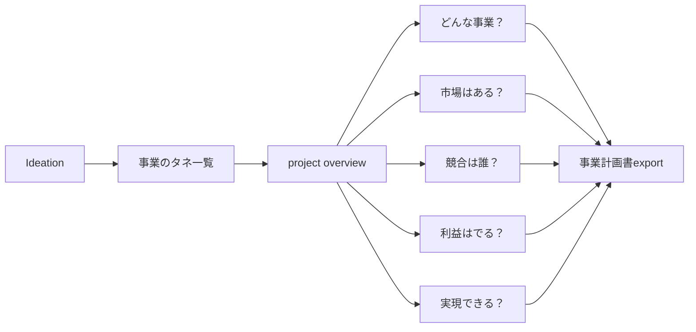

# 事業のタネを5観点で具体化する計画

最終検証日: 2026-08-09

## 要望 / ゴール / 成功指標

### 要望原文

> Ideationから保存したアイデアを事業のタネとして扱い、どんな事業、市場、競合、利益、実現性を個別に具体化し、各ページの内容から事業計画書をexportしたい。固定Stageや通過gateは使わない。銀行・公庫、resource、本業・家庭との両立、事業visual concept、project横断knowledgeも扱う。

### ゴール

利用者が事業のタネごとに5観点の根拠、AI推論、本人判断を分けて蓄積し、任意の観点から検討、再調査、事業計画書のローカルexportを行える状態を定義する。

### 成功指標

- 公開後30日で、事業のタネを開いた利用者の60%が5観点のうち1観点以上に本人確認済みの記録を残す。
- 同期間に、5観点の各ページからの再調査開始の90%以上で、選択したソース、根拠、AI推論、本人判断を区別して表示する。
- 評価用E2Eシナリオで、他人の銀行名、顧客ヒアリング、財務、個人制約、画像prompt、project横断knowledgeが表示・exportされる件数を0件にする。
- exportの90%以上で、選択した観点の根拠と未確認事項を含み、外部送信を発生させずにローカルファイルとして取得できる。

## 正本の関係

- [PRD](PRD.md)は製品全体の体験とMVP受入基準の正本である。本計画はその「アイデア仮説カード」を事業のタネへ具体化する。
- [横断調査・個人ナレッジ・意思決定記憶計画](research-memory-plan.md)は検索、Evidence、RLS、ファイル削除の正本である。本計画はそれらを5観点の根拠に利用する。
- [仮説検証・調査支援仕様](falsification-engine.md)の「市場の見込み」「競合との違い」「攻めどころの特定」は、本計画の市場、競合、実現性ページで参照する。
- 競合との違いと攻めどころは、競合ページの勝ち筋・機会として保存する。市場ページと競合ページのどちらからも更新できるが、同じEvidence IDを重複保存しない。

## 情報設計とUXフロー

- Ideationで対話から保存したアイデアは、本人の事業のタネ一覧に表示する。既存のアイデア仮説カードは事業のタネの概要へ移行可能な入力として扱う。
- project overviewはタイトル、対象顧客、課題、解決案、5観点の状態要約、最終更新、未確認事項を表示する。
- 各観点は`未回答`、`仮説`、`根拠あり`、`本人確認済み`を独立に表示する。順序、必須入力、通過条件は設けない。
- 各ページから入力の編集、根拠の追加、選択ソースによる再調査、本人判断の記録、事業計画書exportを開始できる。
- exportは観点ごとの事実、AI推論、本人判断、出典、未確認事項、生成日時を含む。対象観点未入力時は空欄と未確認を明記し、成功見込みを補完しない。

## 5観点の内容

| 観点 | project overviewに表示する要約 | ページの記録 | 調査・判断の出力 |
| --- | --- | --- | --- |
| どんな事業？ | 顧客、課題、提供価値 | 顧客像、利用場面、提供物、収益仮説、visual concept | 事業仮説、反証、本人確認 |
| 市場はある？ | 市場仮説と検証状況 | 市場定義、顧客ヒアリング、需要根拠、規模の前提、未確認 | 根拠、AI推論、本人判断 |
| 競合は誰？ | 3種競合と勝ち筋 | 直接競合、代替手段、潜在参入者、比較軸、機会 | 勝ち筋、機会、反証、本人判断 |
| 利益はでる？ | 損益分岐の前提と状態 | unit economics、値付け、変動費、固定費、損益分岐、予測財務 | 計算根拠、シナリオ、本人判断 |
| 実現できる？ | 資金・resource・両立の制約 | 銀行・公庫候補、資金調達前提、必要resource、本業・家庭制約、実行リスク | 実行計画、依存、本人判断 |

visual conceptは、事業を説明する画像の目的、対象、構図、禁止表現、画像prompt案を記録する。画像生成や外部送信は行わず、promptは本人所有の機微情報として扱う。

## ユーザーストーリーと受け入れ条件

### US-60-01 事業のタネを開く

As a 起業を検討する利用者, I want Ideationで保存したアイデアを事業のタネとして一覧とoverviewで開きたい, so that 検討対象を迷わず選べる。

Given: 本人がIdeationから保存済みのアイデアを持つ

When: 事業のタネ一覧で一件を選ぶ

Then: 本人のproject overviewと5観点の独立した状態要約だけが表示される

### US-60-02 任意の観点を具体化する

As a 事業案を比較する利用者, I want 5観点の任意のページから仮説と根拠を編集したい, so that 検討の順番を強制されずに進められる。

Given: 事業のタネのoverviewを表示している

When: 未回答を含む任意の観点ページを開いて保存する

Then: その観点の状態だけが更新され、他の観点の状態や本人判断は変更されない

### US-60-03 市場と競合を比較する

As a 顧客需要を確かめる利用者, I want 市場の根拠と3種競合、勝ち筋、機会を分けて記録したい, so that AIの結論を事実と取り違えずに比較できる。

Given: 市場または競合の根拠を一件以上選択している

When: 再調査結果または本人の比較を保存する

Then: 根拠、AI推論、本人判断が区別され、直接競合、代替手段、潜在参入者の未入力も表示される

### US-60-04 採算を検討する

As a 採算を見積もる利用者, I want 値付け、unit economics、損益分岐、予測財務の前提を保存したい, so that 数字の確定値と仮説を区別できる。

Given: 利益ページで価格または費用の入力がある

When: 利用者が予測シナリオを保存する

Then: 入力値、計算式、対象期間、通貨、仮説の状態が表示され、AIは実績や融資可能性を断定しない

### US-60-05 実現条件を管理する

As a 本業や家庭の制約を持つ利用者, I want 銀行・公庫候補、必要resource、個人制約を本人だけに記録したい, so that 実行可能性を現実の条件で考えられる。

Given: 本人が実現性ページに個人制約または金融機関候補を入力している

When: 保存またはexportを実行する

Then: 本人が明示選択した項目だけが表示・exportされ、外部金融機関への問い合わせ、送信、申請は発生しない

### US-60-06 事業計画書を取得する

As a 事業案を説明する利用者, I want 各観点から事業計画書をexportしたい, so that 現時点の根拠と未確認事項を持ち出して見直せる。

Given: 本人が事業のタネの任意の観点ページを開いている

When: export対象と含める個人制約を確認して実行する

Then: 選択済みの本人所有データだけを含むローカルファイルが生成され、外部サービスへ送信されない

### US-60-07 project横断knowledgeを使う

As a 複数の事業案を持つ利用者, I want 自分のproject横断knowledgeを参照候補として選びたい, so that 同じ調査や判断を見つけて再利用できる。

Given: 本人が複数projectにknowledgeを保存している

When: 横断knowledgeを選択して参照する

Then: 本人所有で同意済みのknowledgeだけが候補になり、参照元project、根拠、利用許可状態が表示される

## データ境界と同意

| データ | 所有者と利用範囲 | 同意・表示 | 削除とexport |
| --- | --- | --- | --- |
| 個人プロフィール | 本人。事業のタネへの参照は本人が選ぶ | 調査・export前に選択項目を表示 | プロフィール削除後は参照・export候補から除外 |
| 銀行名・公庫候補 | 本人。実現性ページだけ | 外部問い合わせ・申請は行わないことを表示 | 個別削除でき、exportは明示選択のみ |
| 顧客ヒアリング | 本人。市場ページと同意済み横断knowledge | 第三者の氏名、連絡先、識別子は保存・外部送信しない | 原記録と抽出結果を削除し検索対象から除外 |
| 財務仮説 | 本人。利益ページ | 通貨、期間、仮説か実績かを表示 | 個別削除でき、選択しなければexportしない |
| 画像prompt | 本人。どんな事業ページ | 外部画像生成をしないことを表示 | 個別削除でき、exportは明示選択のみ |
| project横断knowledge | 本人。本人が許可したproject間だけ | projectごとの利用許可と参照元を表示 | 許可取消で候補から除外し、元データ削除で参照不可 |

全所有データの`owner_id`、RLS、認証由来の所有者確定、削除時の原本・抽出本文・埋め込み除外は[research-memory-plan.md](research-memory-plan.md)に従う。リクエスト本文の`owner_id`は信頼しない。顧客ヒアリングの第三者情報、本人の家族・仕事制約、財務、銀行名、画像promptを外部AI、金融機関、画像生成、export先へ送信する実装はCEO決裁まで作らない。

## P0 / P1 / P2

| 優先度 | 要件 |
| --- | --- |
| P0 | Ideationから事業のタネ一覧、overview、5観点ページ、任意順の編集・再調査・状態表示を提供する |
| P0 | 5観点で根拠、AI推論、本人判断を分け、競合の3種、勝ち筋、機会、採算の主要前提を表示する |
| P0 | 個人プロフィール、銀行名、顧客ヒアリング、財務、画像prompt、project横断knowledgeの所有、同意、削除、export境界を適用する |
| P0 | 各ページから、外部送信を伴わないローカル事業計画書exportを提供する |
| P1 | 数式の編集補助、複数予測シナリオの比較、visual conceptのプレビューを追加する |
| P1 | 本人同意済みproject横断knowledgeの重複候補と差分を表示する |
| P2 | CEO決裁後に金融機関、外部AI、画像生成、外部export先のアダプターを評価する |
| P2 | 複数利用者による共同project、共有knowledge、専門家レビューを評価する |

## スコープ外

- 固定Stage、通過gate、必須の観点入力による進行制御。
- 融資審査、融資申請、金融機関への問い合わせ、補助金申請、投資判断の代理。
- 起業の成功、顧客需要、利益、資金調達、特許性、新規性、法令適合の保証。
- 実ユーザーデータを含む外部AI、画像生成、金融機関、外部export先への接続と送信。
- project間または利用者間の既定共有、第三者の個人情報の収集、家族や勤務先への連絡。
- Proの自動調査、メール配信、無人の連続実行。

## E2Eシナリオ

1. 本人がIdeationでアイデアを保存し、事業のタネ一覧からoverviewを開く。
2. 本人が競合ページから直接競合、代替手段、潜在参入者を記録し、根拠と勝ち筋を本人判断として保存する。
3. 本人が利益ページで価格と費用の仮説を入力し、損益分岐と予測財務の対象期間を確認する。
4. 本人が実現性ページで銀行・公庫候補と本業・家庭制約を入力し、export対象から制約を除外してローカルファイルを取得する。
5. 本人が市場ページから同意済みproject横断knowledgeを選び、参照元と利用許可状態を確認して再調査する。
6. 別利用者が同じURLまたはIDを試しても、事業のタネ、5観点、export、横断knowledgeの全てで404または0件となる。

## 質問リスト

| ID | 質問 | 決定者 | 判断期限 |
| --- | --- | --- |
| Q-60-01 | 事業計画書exportの初回形式をMarkdown、PDF、DOCXのどれにするか | CEO | export実装PRの計画前 |
| Q-60-02 | 財務予測で初回に表示する税区分、消費税、減価償却の範囲をどう定めるか | CEO | 利益ページ実装PRの計画前 |
| Q-60-03 | 銀行・公庫の候補情報を利用者の自由記述だけにするか、公開情報の参照を追加するか | CEO | 実現性ページ実装PRの計画前 |
| Q-60-04 | 顧客ヒアリングの匿名化支援の要件と、本人が同意を記録する方式は何か | CEO・法務 | 市場ページ実装PRの計画前 |
| Q-60-05 | project横断knowledgeの初回許可をprojectごとの明示選択にするか、knowledge単位にするか | CEO | 横断knowledge実装PRの計画前 |

## タスク

| ID | 成果物 | 完了判定 | 不確実性 |
| --- | --- | --- | --- |
| SP-60-01 | export形式とローカル生成方式の比較 | 検査: Markdown、PDF、DOCXの日本語、出典、未確認事項、ローカル保存を比較し1営業日で記録 | 未知・先行スパイク |
| SP-60-02 | 財務計算範囲と表示単位の試作評価 | 検査: 3シナリオでunit economics、損益分岐、予測財務の式と丸めを記録し1営業日で終了 | 未知・先行スパイク |
| SP-60-03 | 顧客ヒアリング匿名化と横断knowledge同意の設計評価 | 検査: 合成データで削除、許可取消、他owner拒否の契約を記録し1営業日で終了 | 未知・先行スパイク |
| T-60-01 | 事業のタネ一覧とoverviewのlocal/fake契約 | 検査: US-60-01と5観点の状態要約のUI/APIテストが通る | 類推可能 |
| T-60-02 | 「どんな事業」ページとvisual conceptの所有者契約 | 検査: US-60-02の編集・削除・外部画像生成なしのテストが通る | 類推可能 |
| T-60-03 | 市場ページのEvidence、顧客ヒアリング、本人判断表示 | 検査: US-60-03の市場根拠と匿名化境界のStorybook a11y検査が通る | SP-60-03とresearch-memory-plan.mdのT-03後に類推可能 |
| T-60-04 | 競合ページの3種分類、勝ち筋、機会の表示 | 検査: US-60-03の3種競合と根拠・推論・本人判断のUI/APIテストが通る | research-memory-plan.mdのT-03後に類推可能 |
| T-60-05 | 利益ページの計算契約と予測財務表示 | 検査: SP-60-02の結論に対するunit economicsと損益分岐のテストが通る | SP-60-02後に類推可能 |
| T-60-06 | 実現性ページ、データ同意、project横断knowledgeの所有者契約 | 検査: US-60-05、US-60-07、別owner拒否、削除・許可取消のテストが通る | SP-60-03後に類推可能 |
| T-60-07 | ローカル事業計画書export | 検査: US-60-06のE2Eで選択データだけを含むファイルを生成し、外部リクエストが0件 | SP-60-01後に類推可能 |

T-60-02からT-60-06は5観点の各domainを一つずつ扱うため、各タスクを1 Issue=1 PRとして起票・実装する。T-60-01とT-60-07も独立PRとし、500行未満かつレビュー30分以内で分割する。

## ADR

| 判断 | 選択と理由 | 却下案と理由 | 結果 |
| --- | --- | --- | --- |
| ADR-60-01 進行方式 | 5観点を独立ページとし、観点別状態を表示する。利用者の探索順と保留を尊重できる | 固定Stageと通過gateは、未確定の観点がある利用者を不必要に止めるため却下 | overviewは状態の要約だけを担う |
| ADR-60-02 競合の分類 | 直接競合、代替手段、潜在参入者の3種を保存する。現時点の代替と将来の脅威を区別できる | 競合を一つの一覧にまとめる案は、比較対象とリスクの意味が混ざるため却下 | 勝ち筋と機会は本人判断として別記録にする |
| ADR-60-03 財務の扱い | 前提、式、期間、通貨、仮説状態を保存する。推計の再現性と不確実性を示せる | AIが利益や融資可能性を確定値として提示する案は、誤認を招くため却下 | 実績・外部接続はCEO決裁後に再評価 |
| ADR-60-04 機微データ | 銀行名、顧客ヒアリング、財務、画像prompt、個人制約は本人所有・明示選択・個別削除とする | project間の既定共有と外部サービスへの自動送信は、同意と最小権限を満たさないため却下 | RLSと削除契約はresearch-memory-plan.mdへ従属 |
| ADR-60-05 export | 本人端末でローカル生成し、含める個人データを確認する | 外部ストレージ、メール、金融機関への直接送信は、外部送信と個人情報のリスクがあるため却下 | 形式はSP-60-01とQ-60-01で確定する |

## リスク

| リスク | 影響 | 対応 |
| --- | --- | --- |
| 財務仮説を確定予測と誤認する | 不適切な投資・価格判断 | 仮説状態、前提、式、期間を表示し保証しない |
| 銀行名や家族・勤務制約が漏えいする | 個人情報・信頼の損失 | owner_id、RLS、明示選択、export前確認、外部送信禁止 |
| 顧客ヒアリングに第三者情報が混ざる | 第三者のプライバシー侵害 | 識別子を保存・送信せず、匿名化スパイクと削除契約を先行 |
| 横断knowledgeの無断利用 | project間の期待違反 | projectまたはknowledge単位の明示許可、参照元表示、許可取消 |
| exportに不要な個人制約が含まれる | 意図しない共有 | 観点・フィールド単位の選択とE2E検査 |
| 外部接続が設計から実装へ混入する | 未承認の支出・個人情報送信 | local/fakeとアダプター境界を維持し、CEO決裁前の接続テストを禁止 |

## 変更履歴

| 日時 | 変更 | 理由 | 影響タスク |
| --- | --- | --- | --- |
| 2026-08-09 | 初版。Issue #60の5観点、データ境界、export、分割タスクを定義 | Ideation後の事業具体化をSDD正本へ追加するため | SP-60-01からT-60-07 |
