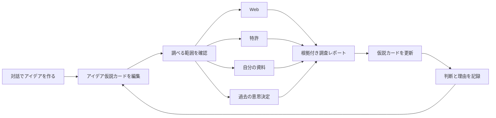
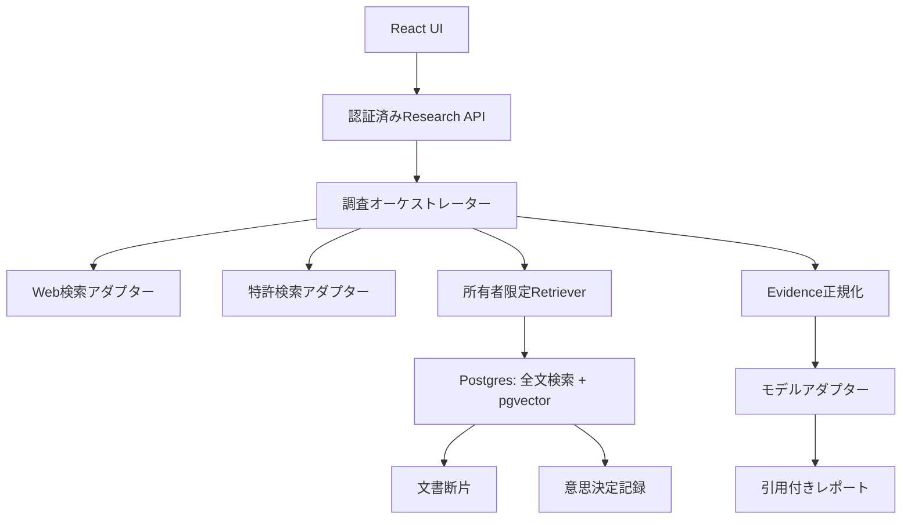

# 横断調査・個人ナレッジ・意思決定記憶 計画 v0.1

最終検証日: 2026-08-09

## 要望 / ゴール / 成功指標

### 要望原文

> これ、基本はWebとかGoogle Patentから調査することになると思うけど、ユーザーがアップロードしたファイルも参照した横断調査も可能にしたいね。内部で個々人のベクトル空間というか、ハイブリッドサーチの仕組みつくらないとね。あとはWeb検索も何かのサービスやMCP使って実現しないとね。あと、意思決定の履歴みたいなものも蓄積して参照可能にして、過去に審議した内容と同じような指摘をユーザーからもらわないようにするとよいね。あと、こういった対話の履歴から得られた情報は適宜ドキュメントに書いていっていいよ。

### ゴール

ユーザーが、Web・特許・自分の資料・過去の意思決定を一つの調査画面から検索し、出典と過去判断を確認しながらアイデア仮説を更新できる状態を作る。

### 成功指標

- 自動テストで、別ユーザーの文書断片・検索結果・意思決定が返るケースを0件にする。
- 評価用調査セットの引用の95%以上で、URL、特許公開番号、ファイルとページ、意思決定IDのいずれかへ到達できる。
- 削除完了から5分以内に、対象ファイルの本文と埋め込みが検索結果へ出なくなる。
- 過去判断と類似する論点を検出した場合、回答に「前回の判断」「今回の新情報」「再検討の要否」を表示する。

## UXフロー

1. 初回対話で作成した「あなたの情報」と、編集中のアイデア仮説カードを調査文脈に含める。
2. 調査前に「Web」「特許」「自分の資料」「過去の意思決定」の選択状態を表示する。
3. アップロード済み資料は、解析中・検索可能・失敗・削除済みの状態を表示する。
4. レポートでは、事実とAIの推論を分け、各主張の直後に出典を表示する。
5. 過去と似た論点は、前回の判断を隠さずに提示し、新情報がある場合だけ再検討を促す。
6. ユーザーが仮説カードを直した後、「市場の見込み」「競合との違い」「攻めどころの特定」を再実行できる。

## ユーザーストーリーと受け入れ条件

### US-01 自分の資料を検索対象にする

As a 起業アイデアを検討するユーザー, I want 自分のファイルを登録して調査対象にしたい, so that 手元の知識と公開情報を一緒に検討できる。

Given: 認証済みユーザーが対応形式・上限内のファイルを選んでいる

When: アップロードと解析が完了する

Then: ファイル名、版、解析状態、検索可能日時が本人の資料一覧に表示される

Given: ユーザーAとユーザーBが異なる資料を登録している

When: ユーザーAが同じ検索語で横断検索する

Then: ユーザーBの資料、断片、メタデータは結果にもログにも含まれない

Given: ユーザーAが作成した所有データがある

When: ユーザーBがSELECT、所有者偽装INSERT、UPDATE、DELETEを試すか、未認証で同じ操作を試す

Then: 全操作が拒否され、サービスロールを使う運用APIだけが明示された処理を実行できる

### US-02 複数ソースを横断調査する

As a アイデア仮説を編集するユーザー, I want Web・特許・自分の資料を一度に調べたい, so that 情報源ごとの検索を繰り返さずに仮説を見直せる。

Given: 一つ以上の調査ソースが選択されている

When: ユーザーがアイデア仮説カードから調査を開始する

Then: ソース別の進行状態と、根拠付きの統合レポートが表示される

Given: 一部の外部検索がタイムアウトした

When: 他のソースから結果を取得できた

Then: 取得済みの結果を表示し、未取得ソースと再試行操作を明示する

### US-03 特許を根拠として確認する

As a 技術アイデアを検討するユーザー, I want 関連特許を検索したい, so that 新規性の断定ではなく先行技術の候補を確認できる。

Given: 特許ソースが選択されている

When: 調査が完了する

Then: 各特許候補に公開番号、名称、出願人、公開日、参照先、類似と判断した理由が表示される

Given: 特許候補が0件である

When: レポートを表示する

Then: 「特許が存在しない」とは断定せず、検索語・対象範囲・検索日時を表示する

### US-04 過去の意思決定を踏まえて回答する

As a 継続利用するユーザー, I want 過去の判断と理由を今回の対話へ反映したい, so that 解決済みの論点を毎回最初から説明せずに済む。

Given: 類似論点に対する有効な意思決定記録がある

When: AIが同種の懸念を生成する

Then: 前回の判断、根拠、決定日、今回変化した前提を示し、重複指摘として文脈化する

Given: 新しい根拠が過去判断と矛盾する

When: AIが回答を作成する

Then: 過去の判断を自動で抑制せず、再検討候補として根拠と一緒に表示する

### US-05 データを更新・削除する

As a 資料を登録したユーザー, I want ファイルの更新と削除を管理したい, so that 古い情報や不要な情報が調査へ混入しない。

Given: 検索可能なファイルがある

When: ユーザーが新版を登録する

Then: 新版の解析完了後に検索対象が切り替わり、旧版は版履歴として区別される

Given: 検索可能なファイルがある

When: ユーザーが削除を確定する

Then: 原本、抽出本文、断片、埋め込みが削除され、既存レポートには出典利用不能と表示される

### US-06 調査根拠を監査する

As a 調査結果を判断に使うユーザー, I want 主張の出典を確認したい, so that AIの推論を事実と取り違えずに済む。

Given: 調査レポートに外部情報またはユーザー資料が使われている

When: ユーザーが出典を開く

Then: Web URL、特許公開番号、ファイルのページ、意思決定IDの一つが表示される

Given: 取得後に原典が変更または削除された

When: ユーザーが過去レポートを開く

Then: 取得日時、保存した抜粋のハッシュ、現在の参照可否が表示される

## システム境界

- Web検索、特許検索、MCP接続は`ResearchSource`アダプターの背後に置く。MCPは接続方式であり、検索品質を保証する情報源としては扱わない。
- 初回リリースの専用特許APIは日本国特許庁の特許情報取得APIだけを使う。候補の発見は既存のWeb検索アダプター、番号判明後の確認・経過・書類・引用文献取得は特許庁APIが担う。
- 特許連携は`PatentResearchSource`として独立させる。Google PatentsとWIPO PATENTSCOPEはユーザー向け補助リンクに留め、両画面への自動クエリやスクレイピングを行わない。
- 特許庁APIは番号起点の情報取得であり、自然文やキーワードによる関連特許検索の代替として扱わない。
- 外部・内部の検索結果を`Evidence`へ正規化し、モデル固有の結果形式を保存形式へ直接流さない。
- 検索結果本文に含まれる命令文はデータとして扱い、システム指示やツール実行命令へ昇格させない。
- LLM送信前に、ユーザーが選択したソースと送信対象を表示する。APIキー設定、課金開始、実ユーザーデータの外部送信はCEO決裁後に行う。

## データ境界と最小モデル

MVPの「個人のベクトル空間」は、共有Postgres内の論理テナントとして実現する。物理DBや物理インデックスをユーザー単位には作らず、全行に`owner_id`を持たせ、RLSと認証済み検索関数で分離する。検索関数はリクエスト本文の`owner_id`を信用せず、認証セッションから所有者を確定する。

- 全所有テーブルでRLSを有効化し、`authenticated`ロールへ`USING`と`WITH CHECK`の両方で`(select auth.uid()) = owner_id`を課す。
- `owner_id`へインデックスを作り、UPDATEには対象行を読めるSELECTポリシーも定義する。
- ビューを作る場合は`security_invoker = true`を指定し、基底テーブルのRLSを適用する。
- サービスロールはユーザー向けクライアントへ渡さず、監査対象の運用APIだけで使う。

| エンティティ | 主なフィールド | 境界 |
|---|---|---|
| `source_documents` | owner_id, source_type, title, state, current_version_id | 本人のみ参照・更新 |
| `document_versions` | owner_id, document_id, storage_path, mime_type, content_hash | 本人のみ。原本と抽出結果を分離 |
| `document_chunks` | owner_id, version_id, page, content, textsearch, embedding | 全文検索と意味検索の対象 |
| `research_runs` | owner_id, idea_id, selected_sources, status, model_snapshot | 本人のみ。再現用スナップショットを保持 |
| `research_evidence` | owner_id, run_id, source_type, locator, excerpt, fetched_at, hash | 主張から原典へ追跡 |
| `decision_records` | owner_id, idea_id, status, decision, rationale, valid_from, supersedes_id | 過去判断を上書きせず継承関係を保持 |
| `decision_observations` | owner_id, decision_id, observation, disposition, evidence_id | 指摘、採否、根拠を分離 |

### ハイブリッド検索

- 完全一致寄りの検索はPostgresの`tsvector`とGINインデックスを使う。
- 意味の近さは`pgvector`とHNSWインデックスを使う。
- 二つの順位はReciprocal Rank Fusionで統合する。
- 特許公開番号、企業名、製品名はキーワード順位を優先し、課題・用途・顧客像は意味検索を併用する。
- 検索結果は`owner_id`、文書状態、版、削除状態で絞った後に返す。

### ファイル取り込み

`アップロード → サイズ・形式・マルウェア検査 → 原本保存 → 文字抽出 → 断片化 → 全文索引 → 埋め込み → 検索可能`の順に処理する。圧縮爆弾、巨大ページ、暗号化ファイル、埋め込みスクリプト、プロンプトインジェクションを失敗理由または非信頼入力として扱う。

## API境界案

| 操作 | 入力 | 出力 | 主な失敗 |
|---|---|---|---|
| `POST /v1/documents` | ファイル、表示名 | document_id、解析状態 | 形式外、上限超過、検査失敗 |
| `GET /v1/documents/{id}` | document_id | 所有者限定メタデータ | 404で非所有と不存在を区別しない |
| `DELETE /v1/documents/{id}` | document_id、確認値 | deletion_id | 競合、処理中 |
| `POST /v1/research-runs` | idea_id、query、selected_sources | run_id、ソース別状態 | 未決裁の外部送信、利用上限、外部障害 |
| `GET /v1/research-runs/{id}` | run_id | Evidence付きレポート | 404で非所有と不存在を区別しない |
| `POST /v1/decisions` | idea_id、判断、理由、根拠参照 | decision_id | 理由不足、根拠参照不正 |
| `GET /v1/decisions/search` | idea_id、論点 | 類似判断と差分 | 対象なし |

## プラン境界

- Free: 軽量モデル、Thinking Effortなし。手動の横断調査には月次回数と処理量の上限を置く。上限値は原価スパイク後に決める。
- Standard: 980円/月。ユーザーが許可されたモデルを選択し、既定は`gpt-5.6-terra`。Freeより大きい調査上限を持つ。
- Pro: 2980円/月。定期的な深掘り調査とメール配信は初回リリースに含めない。利用量と原価データの蓄積後に再計画する。

## 質問リスト

| ID | 質問 | 決定者 | 判断期限 |
|---|---|---|---|
| Q-01 | 初回対応ファイルをPDF、DOCX、TXT、CSVとし、画像PDFのOCRを次版へ送るか | CEO | ファイル取込PRの計画前 |
| Q-02 | 1ファイルの上限、1ユーザーの保存容量、保持期間を何MB・何日とするか | CEO | 原価スパイク後 |
| Q-03 | Web検索の第一候補をAnthropic Web Searchとし、独立サービス/MCPを比較対象にするか | CEO | 検索アダプターPRの計画前 |
| Q-04 | Web検索で発見した特許候補の見逃し率が基準を満たさない場合、特許庁の一括ダウンロードデータを自前索引へ追加するか | CEO | SP-02後。データ基盤PRの計画前 |
| Q-05 | 埋め込みモデルへ送る本文、保存地域、保持、学習利用条件をどこまで許可するか | CEO | 実データ外部送信前 |
| Q-06 | 削除済み原典を参照した過去レポートの抜粋を残すか、ハッシュと参照不能表示だけ残すか | CEO | 削除設計PRの計画前 |

## スコープ外

- Proの定期調査、バックグラウンド自動実行、メール配信。
- 特許性、新規性、侵害有無の法的判断。
- ユーザー間の資料共有、共同ワークスペース、組織管理。
- 初回リリースでのユーザー単位の物理DB、物理インデックス、専用暗号鍵。
- 外部サイトへの自動投稿、外部公開、検索結果を使った自動契約・自動申請。
- 検索プロバイダーの自動切替と無審査のモデル更新。
- Google Patents、WIPO PATENTSCOPE、海外特許庁APIの機械連携。

## タスク

| ID | 成果物 | 完了判定 | 不確実性 |
|---|---|---|---|
| SP-01 | Web検索候補の品質・引用・料金・データ保持比較 | 検査: 固定10問で再現率、引用到達率、1調査原価を記録し2営業日で終了 | 未知・先行スパイク |
| SP-02 | Web検索による候補発見と特許庁APIによる確認の品質・上限試験 | 検査: 固定5テーマで候補発見率、公開番号、出願人、日付、引用文献、API呼出数を記録し2営業日で終了 | 未知・先行スパイク |
| SP-03 | 対応候補4形式の文字抽出・断片化・プロンプト注入耐性の試験 | 検査: 合成資料20件で抽出成功率、ページ対応、拒否理由を記録し2営業日で終了 | 未知・先行スパイク |
| T-01 | owner_id付き検索スキーマとRLS設計PR | 検査: A作成後にBのSELECT、偽装INSERT、UPDATE、DELETEと未認証操作を拒否し、全文・ベクトル検索も0件 | 類推可能 |
| T-02 | ファイル取込状態モデルと削除契約PR | 検査: API契約テストで成功、失敗、再試行、削除を確認 | SP-03後に類推可能 |
| T-03 | `ResearchSource`と`Evidence`のAPI契約PR | 検査: 偽Web・偽特許・偽内部検索で同じEvidence形式になる | SP-01、SP-02後に類推可能 |
| T-04 | ハイブリッド検索PR | 検査: 特許番号完全一致と意味類似の評価セットが基準値を満たす | T-01後に類推可能 |
| T-05 | 意思決定記憶と再検討表示PR | 検査: 過去判断あり、新根拠あり、失効判断の3シナリオをUI/APIテストで確認 | 類推可能 |
| T-06 | 横断調査UIと引用表示PR | 検査: 初回ヒアリング、仮説カード、調査、出典、過去判断差分のPC・スマホStory、キーボード操作、`parameters.a11y.test = 'error'`がCIで通る | T-02からT-05後に類推可能 |

各タスクは1 PR 1目的とし、本計画から個別の受け入れ条件を引用する。未知の項目はスパイクの結論とCEO決裁が得られるまで本実装タスクへ移さない。

## ADR

| 判断 | 選択と理由 | 却下案と理由 | 結果 |
|---|---|---|---|
| ADR-01 個人検索空間 | 共有Postgres上の`owner_id`、RLS、認証由来の所有者条件を選ぶ。現行Supabase基盤を再利用でき、MVPの運用負荷を抑えられる | ユーザーごとの物理DBを却下。初期運用と移行が複雑になる | 規模、地域分離、企業契約の要件が出た時点で再評価 |
| ADR-02 検索方式 | `tsvector`と`pgvector`をRRFで統合する。固有名詞と意味類似を同じ検索で扱える | ベクトル検索単独を却下。特許番号と固有名詞の完全一致が弱い | 検索評価セットで重みを調整する |
| ADR-03 外部検索境界 | プロバイダー中立の`ResearchSource`と`Evidence`を選ぶ。引用と保存形式を統一できる | Anthropic固有形式の直結を却下。モデル変更時に履歴の再利用が難しい | SP-01後に最初のアダプターを決める |
| ADR-04 重複指摘 | 過去判断を添えて文脈化し、新根拠がある場合は再掲する | 同種指摘の機械的な非表示を却下。重要なリスクを隠す恐れがある | 「前回」「今回の差分」「再検討」を表示する |
| ADR-05 特許ソース | 初回版の専用APIは日本国特許庁APIだけを選ぶ。Web検索で候補を発見し、番号起点で公式情報を確認する | 特許庁API単独の候補発見を却下。自然文・キーワード検索APIではない。Google/WIPOの機械連携も初回版では却下し、接続先と運用を増やさない | SP-02で不足する場合だけ特許庁一括データの自前索引を再検討 |

## リスク

| リスク | 影響 | 対応 |
|---|---|---|
| RLS漏れまたはサービスロール誤用 | 別ユーザー資料の漏えい | 認証由来owner_id、SQL侵入テスト、サービスロール経路の限定 |
| 外部検索クエリへの個人情報混入 | 外部送信と規約違反 | 送信前表示、秘匿語検出、同意、監査ログ |
| 文書・Webのプロンプトインジェクション | 誤回答または意図しないツール実行 | 検索本文を非信頼データ化し、ツール権限と命令を分離 |
| 削除後の埋め込み残存 | 削除要求の不履行 | 削除ジョブ、索引除外、完了監査、復旧用バックアップ方針の明示 |
| 過去判断の過信 | 前提変化の見落とし | 有効期間、継承関係、新根拠との差分を表示 |
| 特許データの遅延・欠落 | 誤った新規性の印象 | 検索日時と範囲を表示し、法的判断ではないと明記 |
| 特許画面の規約違反 | 接続遮断、契約・法務リスク | 自動検索とスクレイピングを行わず、許諾済みAPIまたはデータセットだけを接続 |
| 特許庁APIの試行提供・日次上限 | 調査の遅延または取得失敗 | 呼出数計測、キャッシュ、利用上限、部分結果表示を実装 |
| 検索・埋め込み原価の増大 | サブスク採算の悪化 | プラン上限、キャッシュ、原価計測、Pro実装の延期 |

## 参照資料

- [Supabase Hybrid Search](https://supabase.com/docs/guides/ai/hybrid-search)
- [Anthropic Web Search tool](https://platform.claude.com/docs/en/agents-and-tools/tool-use/web-search-tool)
- [Anthropic Search results](https://platform.claude.com/docs/en/build-with-claude/search-results)
- [Google Cloud BigQuery public datasets](https://docs.cloud.google.com/bigquery/public-data)
- [Google Patents Public Datasets](https://cloud.google.com/blog/topics/public-datasets/google-patents-public-datasets-connecting-public-paid-and-private-patent-data)
- [Google Patents Search results](https://support.google.com/faqs/answer/7049588)
- [WIPO PATENTSCOPE](https://www.wipo.int/en/web/patentscope/)
- [WIPO PATENTSCOPE Terms of Use](https://www.wipo.int/en/web/patentscope/data/terms_patentscope)
- [WIPO PCT Data Products and Services](https://www.wipo.int/en/web/patentscope/data/index)
- [日本国特許庁 特許情報取得API](https://www.jpo.go.jp/system/laws/sesaku/data/api-provision.html)
- [日本国特許庁 API仕様](https://ip-data.jpo.go.jp/api_guide/api_reference.html)
- [日本国特許庁 特許情報の一括ダウンロード](https://www.jpo.go.jp/system/laws/sesaku/data/download.html)

## 変更履歴

| 日時 | 変更 | 理由 | 影響タスク |
|---|---|---|---|
| 2026-08-09 | 初版。横断調査、個人検索空間、意思決定記憶を定義 | ユーザー対話で製品方針が確定したため | SP-01からT-06 |
| 2026-08-09 | 初回版の専用特許APIを日本国特許庁APIへ限定 | 公式APIを優先し、外部連携を最小化するため | SP-02、T-03、ADR-05 |
