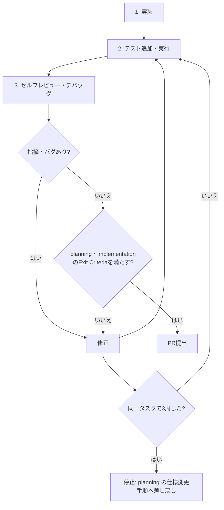

# implementation — 実装規律

最終検証日: 2026-08-09

## 目的

変更をテスト・レビュー・デバッグと反復し、仕様どおりで保守可能なPRにする。

## 適用タイミング

- planning の Exit Criteria を満たしたタスクを実装するとき。
- 実装、設定、API、データモデルを変更するとき。

## 再帰ループ



各周は「テスト実行からレビュー判断まで」と数える。3周しても停止条件を満たせない場合、実装を続けず、計画文書に矛盾箇所と差し戻し理由を記録して planning に戻る。4周以上の力技の反復は禁止する。

## 手順

1. 計画の受け入れ条件、対象タスク、完了判定を読み、差分の範囲を固定する。
2. 意図を表す名前を使う。略語は一般的なものだけにし、関数は1つの責務を持たせる。関数が画面・API・永続化・副作用を同時に扱い始めたら分割する。
3. 通常は、失敗するテストを先に追加し、最小の実装で通す。探索的プロトタイプだけはテストを後回しにできるが、本実装前にテストを追加する。
4. エラーを回復可能と回復不能に分類する。利用者には次の行動が分かるメッセージだけを返し、原因・相関ID・スタック情報は内部ログへ分離する。秘密情報、認証情報、個人情報をログへ出さない。
5. API は名詞中心で一貫したエンドポイント名を使い、エラーレスポンスの形式を統一する。既存利用者を壊す変更は、互換レイヤー・バージョン・段階的移行のいずれかを計画に記録してから行う。
6. ルート `AGENTS.md` の検査コマンドを実行してテストを追加する。`testing-and-ci` スキル追加後は、そのスキルも読む。
7. `git diff` を1行ずつセルフレビューする。指摘またはバグがあれば修正し、手順6へ戻る。`review-and-debug` スキル追加後は、そのスキルも読む。
8. この文書と planning の Exit Criteria を満たしたときだけPRを提出する。

## Exit Criteria

- ◎ 変更は計画の受け入れ条件と対応づいている。検査: PR説明にタスクIDとテスト名を記載する。
- ◎ 本実装には失敗するテストを先に用意した証跡がある。検査: テスト追加コミットまたはPRのテスト説明を確認する。プロトタイプ例外は理由と本実装前のテスト追加を記録する。
- ◎ 例外・失敗経路が利用者メッセージと内部ログに分離されている。検査: `rg -n -i "password|secret|token|authorization" <変更ファイル>` で値のログ出力がないことを確認する。
- ◎ API変更は一貫したエラー形式と後方互換方針を持つ。検査: 既存のAPI契約テストと変更後の契約を比較する。
- ◎ ルート `AGENTS.md` が指定する変更範囲の検査を通す。検査: 実行したコマンドと結果をPR説明に添付する。
- ◎ 同一タスクで3周した場合、planning への差し戻し記録がある。検査: 計画文書の変更履歴に矛盾箇所と理由があることを確認する。

## アンチパターン

- 動作確認だけでテストを省略し、そのままPRを出す。
- 例外を握りつぶす、または利用者向けレスポンスに内部エラーを露出する。
- ログにトークンや認証ヘッダーをそのまま書く。
- 3周後も仕様を変えずに4周目の修正を始める。

## 成果物様式

```md
## 実装メモ
- 計画タスク: T-...
- 受け入れ条件: US-...
- 追加テスト: <ファイルまたはテスト名>
- エラー分類: 回復可能 / 回復不能
- API互換性: 影響なし / <移行方針>
- ループ周回数: 1
- 検査結果: <コマンドと結果>
```

## 良い実行例

入力検証の失敗を再現するテストを先に追加し、利用者には修正方法を返しつつ、内部ログには相関IDだけを記録する。テスト、セルフレビューを経てPRにタスクIDと検査結果を記載する。

## 悪い実行例

例外を `catch` して成功扱いにし、認証トークンをデバッグログへ出す。秘密情報検索と失敗経路のレビューにより、Exit Criteria の第3項で検出される。

## 次に読むスキル

現時点では、ルート `AGENTS.md` の検査・レビュー手順に従う。`testing-and-ci` と `review-and-debug` が追加された後は両方を読む。3周後は [planning](../planning/SKILL.md) に戻る。
